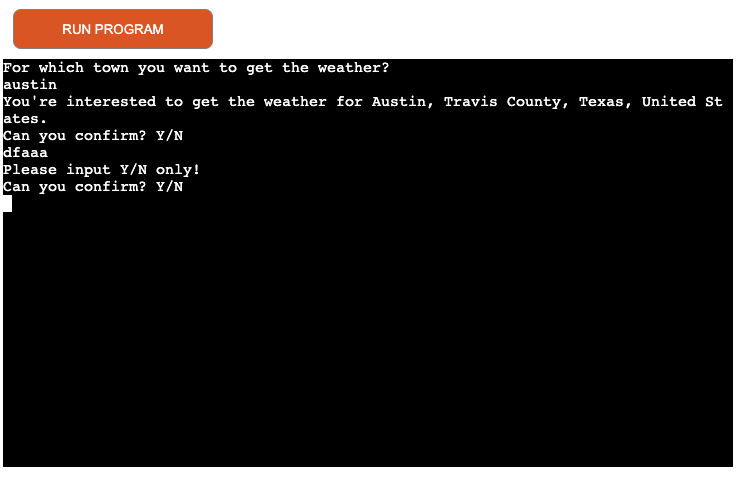
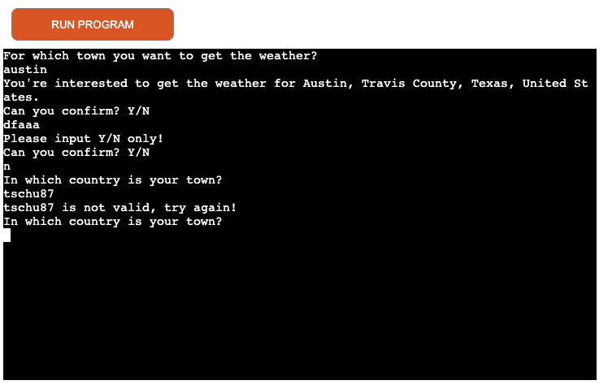
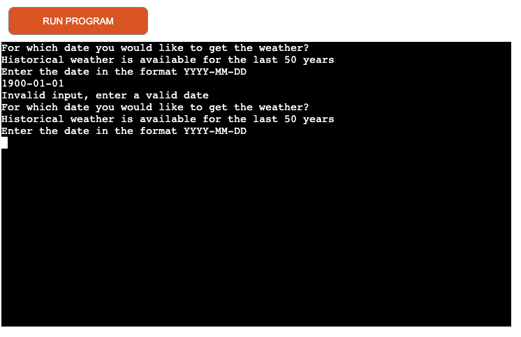

# Sunshine - A CLI Weather App
The main purpose of this CLI terminal based site is, to provide weather information for any given location. It uses a simple CLI based questionary to navigate the user through the app.
It should be a fun way to get real time weather information, using the Free Weather API of [Open-Meteo](https://open-meteo.com/en)


---

## Objectives
This sections covers the main goals, which I had in mind, when creating this project. This project is purely in Python as a simple CLI Terminal app, part of the Code Institute's Project Portfolio 3.

### Main Objectives
My goal was to learn from mistakes I did in the last two projects, specially in the planning phase.
I wanted to include an API and came along the Free Weather API of [Open-Meteo](https://open-meteo.com/en), which I really liked and in combination with using the [Geopy Package](https://pypi.org/project/geopy/), I had an interesting and challenging Python project. I wanted to cover the following main objectives:

- create user input main menu to choose for a feature as well as easy CLI navigation inside each menu
- main feature to get live weather for a location anywhere in the world
- using the geopy Open StreetMap Nominatim API, to find the user input location and get the latitude and longitude information
- create a dedicated class to include the API call to the Open-Meteo API
- display the weather info received from the API and enrich it with further infos based on the weather code, which is part of the API result.
- Temperature and analysis of the weather code, based on [WMO Weather interpretation codes](https://open-meteo.com/en/docs)
- if there is wind, it should be displayed
- option to get historical weather data using the [Historical Open Meteo API](https://open-meteo.com/en/docs/historical-weather-api)
- show historical data for requested location getting the weather code for the daily weather summary, wind information
- correlate the WMO weather interpretation with emojis to display for the user

### Stretch Objectives

The following stretch objectivse are meant as a "nice to have" feature and depending on the time, I will implement them or not.

- get offline data for a specific set of cities (could be all capitals in Europe or similar) for the last year (2022)
- offline data should provide an alternate solution, if either geopy or the weather API is down
- implement a random city feature, intended for users who are curious about weather conditions anywhere in the world, without specifying a place.

## UX & Design
This site is a pure terminal based CLI app, which has limited browser support and runs in a default terminal window size of 80 columns by 24 rows.

### User Stories

- As a visiting user, I would like to immediately understand the navigation through the app
- As a visiting user, I would like to get the live weather data for my given location
- As a visiting user, I would like to get the historical weatehr data for a particular day in past for a particular location.
- As a visiting user, I would like to get the results of the weather displayed in a short and easy to understand format.
- As a visiting user, I would like to get enhanced weather information such as wind, weather condition.

---

## Features

This chapter will describe each feature of the application.

The main goal of this app was to show and improve my Python skills. The deployment via Heroku as well as the deployment template / terminal emulation inside the browser, were provided to be used in this project. With this, there came some limitations. Furthermore, this project is not responsive and runs only on bigger screens (tablet or bigger). **Please Note, this app will only run in Chrome browser, without any issues!** This is due to limitations in the way the app is deployed, made accessible as a Terminal app inside the browser as well as some browser issues. More details on that in the testing / bugs section.

### Existing Features

- Main Menu - Entry point
    - The main menu displays a nice welcome message and explains the main purpose of the app
    - It gives a clear and easy overview of the features, from which the user can choose from
    - It tells the user to make it's choice and enter the related number
    - It gives the user the possibility to start / restart the app / terminal, via the big red "Run Program" Button

    

- Live weather data (Menu Item 1)
    - The first feature out of the main menu is live weather data.
    - The user get's prompted to enter a town, for which he wants live weather data.
    
        

    - Once the user has entered the town and pressed enter, he will be presented with a "best match" proposal of the town.
    - The user has the choice to accept the proposal or to deny it, because it was not the town he was looking for.
    - If he accepts the proposal and enters yes, the weather data will be shown, please scroll down a few screenshots for an explanation of this option.
    
        

    - If the user denies the proposal, he will get the option to specify the country, in which his desired town is in.

        

    - Once the user has entered the country and pressed enter, he will be presented with a "best match" proposal of the desired town, based on the country
    - The user has the choice accept or deny the proposal.
    - If he accepts the proposal and enters yes, the weather data will be shown, please scroll down a few screenshots for an explanation of this option.

        

    - If the user denies the proposal, he will get the option to specify the postal / zip code, in which his desired town is in.

        

    - Once the user has entered the postal / zip code, he will be presented the final result.
    - This is the last step in the decision tree, because while have entered country, town, zip code - it is considered as a unique selection criteria.
    - The user get's displayed the info about the location he has asked for, it is the data, which the geopy Open StreetMap Nominatim database has stored for a particular location. It displays enhanced geoinfo about the location.
    - The live weather is presented, as fetched via the [Open-Meteo](https://open-meteo.com/en) database
    - The first result is the temperature.
    - The second result is the actual weathercondition, which is the translated, standardized [WMO Weather interpretation codes](https://open-meteo.com/en/docs).
    - The weathercondition gets enriched via a matching emoji, to make the interpretation more appealing.
    - The user gets asked if he wants to make another turn of live wheather, which would clear the screen and bring him back to enter a new town.

        

    - If in any of the above displayed proposals (town, country) the user enters "Y" to accept the proposal, he will  immediately get displayed the weather results, as shown in the next snapshot. The same logic / explanation is valid as previously explained.

        

    - If the user decides to not check another location for live weather and answer the question with "N", he will be sent back to the main menu.
    - In all the confirmation questions, if the user enters a invalid input, not entering y / n, the error is caught and he will be repeteadely asked.

        

    - The address input is validated for correct and valid input. The same applies for the country and postal code / zip input. 
    - For postalcode / zip and country input, the [postal code format](https://kb.bullseyelocations.com/article/93-postal-code-formats) and [list countries](https://www.worldometers.info/geography/alphabetical-list-of-countries/) have been considered.
    - Wrong inputs will relate to a message prompted and the user gets asked again.

        

- Historical Weather Data (Menu Item 2)
    - The second feature of the main moneu is the historical weather data.
    - The user is prompted to enter a historical data, for which he wants to see the weather. The weather database is limited in historical data, therefore the user is able to ask back 50 years.
    - The input format is specified

    

    - The subsequent questions / features are the same as for the live weather with the only exception, that the wording of the answers is in "the past".
    - The decision tree itself is the same

    

    - If the user enters an invalid date format or a date, which is more than 50 years in past, he will get an error and will be repeatedly asked to enter a valid date.

    

- Weather for Random Location (Menu Item 3)
    - This feature is not implemented yet, however, since planned I left it on the main menu
    - If a user enters the option 3 for the weather of a random location, he will get a text displayed, saying that the feature is not implemented yet.
    - The user will be informed, that he well be automatically redirected to the main menu

    

- Exit Program (Menu Item 4)
    - This feature will gracefully end the program.
    - The user gets a goodbye message displayed

    

- Start / Restart Program
    - If the user has gracefully exit'ed the program or his browser did run in timeout, he can start the program via the "RUN PROGRAM" button above the terminal.

    

     
### Future Features

- The Weather for Random Location (Menu Item 4) will be implemented
    - To implement this, the [Geonamescache Package](https://pypi.org/project/geonamescache/) will be used
    - The geonamescache provides various functions, the `get_cities()` function will be used and further processed, to get a random city name.
- Offline City geo-database for all capitals in the world.
    - This feature would be implemented in the way that, for whatever reason the Geopy Open StreetMap Nominatim database would not be available or a user has stressed their API and "violated" the [Usage Policy](https://operations.osmfoundation.org/policies/nominatim/)
    - This feature would store the geoinfo for all the capitals in a database, or a google spreadsheet and will then be used for the API call of the weather database.

---

## Tools & Technologies Used
I used the following technologies and resources to create this site:

- [Git](https://git-scm.com)
    - Git has been used as the CLI version control tool
- [Github](https://github.com)
    - Github has been used to store the code and publish the site via Github Pages
- [Gitpod](https://gitpod.io/)
    - Gitpod has been used as the local IDE environment
- [Techsini](http://techsini.com/multi-mockup/index.php)
    - Techsini has been used to show an image of the site on various devices
- [OpenStreetMap Geopy Nominatim](https://nominatim.openstreetmap.org/ui/about.html)
    - The OSM Geopy Nominatim API has been used to get the geolocation, via the geopy python package
- [Open Meteo API](https://open-meteo.com/)
    - The Open Meteo API has been used to get all the weather information
- [Markdown Builder](https://traveltimn.github.io/readme-builder)
    - The Markdown Builder by Tim Nelson has been used to help generate the README files
- [Python](https://www.python.org) 
    - Python has been used as the main programming language.
- [Draw.io](https://app.diagrams.net)
    - Draw.io has been used to create the flowchart and export it as png

---

## Data Model

### Logical Flowchart
The following flowchart displays the logic behind the app, it should be seen as kind of "wireframe", which I have used to have a rough estimate and structure, while building the code for the application.


### Classes, their Methods & Functions

This chapter will give a brief explanation on the classes their related methods and the functions, used in the code.
I have created two classes for code, which I re-usable and to me, is a perfect place to live in a class.

#### The MeteoDataCall Class
This class contains two methods; the `live_data()` and the `historical_data()` method. The class itself takes one argument, when called - the coordinates, which is actually an array with two elements, the latitude [0] and the lingitude [1]. Since both methods needs the coordinates as input, it has been specified at the class level.
The `live_data()` method, does not require additional paramters, when called. The main purpose of this method is, to execute the api call to the open-meteo api. The url string for the api call is statically set as variable, but taking the coordinates array elemtens via string interpolation.
It uses the requests library to make a GET request to the open-meteo.com API with the given location. The raise_for_status method is called on the response object to raise an exception if the API returns a non-successful
status code.

The fetch_data method is wrapped in a try block, and any HTTPError exceptions that are raised during the requestare caught in the except block.
The return value of the api is a json, which will be further processed as the return value.
If an exception gets raised, the program gets **intentionally** terminated, because it does not make sense tocontinue the program, if the API has a problem.
If there is a HTTP error, not getting code 200 back from the API, the status code is displayed to the user. Forall the other, unknow errors, no error details are displayed.
The `historical_data()` method works the same way as the previously explained `live_data()` method, with the onlydifference, that it needs an additional argument, when called. It requires the date, for which the user wants toget the historical weather info. 
The url for the API call uses again the coordinates array values and, as explained, the historical date. The restof the method is the same.


<details>
<summary>MeteoDataCall Class Code</summary>

```python
class MeteoDataCall:
    """
    Class to execute api call for live and historical
    weather on open-meteo.com. Error handling done at
    this stage.
    """
    def __init__(self, coordinates):
        # instance attributes
        self.coordinates = coordinates

    def live_data(self):
        """
        Method to call API for live data and return json
        If call is unsuccessful, start exception handling.
        """
        url = f"https://api.open-meteo.com/v1/forecast?latitude={self.coordinates[0]}&longitude={self.coordinates[1]}&current_weather=true&windspeed_unit=kmh"  # noqa
        # Create the actual api call. If the request is successful,
        # the raise_for_status() method is called to check for any HTTP errors,
        # such as a 4xx or 5xx status code.
        # If no errors are found, the JSON response is returned.
        try:
            response = requests.get(url)
            response.raise_for_status()
            return response.json()
        # Handle known HTTP error and exit
        except requests.exceptions.HTTPError as error:
            sys.exit(
                "An error has occured when calling the Open-Weather API \n"
                "Unfortunately we cannot get the weather data now. \n"
                "Please try again later! \n"
                "Error details: {}".format(error)
                )
        # Handle any unknown API error and exit
        except Exception as error:
            sys.exit(
                f"There was an undefined error with the Open-Weather API \n"
                "Please try again later"
                f"Error details: {error}"
                )

    def historical_data(self, hist_date):
        """
        Method to call API for historical data and return json
        If call is unsuccessful, start exception handling.
        """
        self.hist_date = hist_date
        url = f"https://archive-api.open-meteo.com/v1/era5?latitude={self.coordinates[0]}&longitude={self.coordinates[1]}&start_date={self.hist_date}&end_date={self.hist_date}&daily=weathercode,temperature_2m_max,windspeed_10m_max&timezone=auto"  # noqa
        # Create the actual api call. If the request is successful,
        # the raise_for_status() method is called to check for any HTTP errors,
        # such as a 4xx or 5xx status code.
        # If no errors are found, the JSON response is returned.
        try:
            response = requests.get(url)
            response.raise_for_status()
            return response.json()
        # Handle known HTTP error and exit
        except requests.exceptions.HTTPError as error:
            sys.exit(
                "An error has occured when calling the Open-Weather API \n"
                "Unfortunately we cannot get the weather data now. \n"
                "Please try again later! \n"
                "Error details: {}".format(error)
                )
        # Handle any unknown API error and exit
        except Exception as error:
            sys.exit(
                f"There was an undefined error with the Open-Weather API \n"
                "Please try again later"
                f"Error details: {error}"
                )
```

</details>

#### The DateInputVerifier Class
This class is used for the historical weather feature and is used to verfiy if the date input is valid and according to the requirements. The class itself does not require any arguments and it has the basic date syntax stored in the pattern variable. This simple regex checks only the amount of digits and the required hyphen.
The `is_valid()` method takes the date as an input parameter. A conditional sequence starts, first of all is the check of the input against the pattern - the regex. If that is passed, it will split the input at the hyphen and allocate the variables year, month, day to it.
The month get's checked if it is valid, only integers between 1 and 12 are valid.
The day gets checked if it si valid, only integers between 1 and 31 are valid.
The year gets checked, if it is max. 50 years back from the current year. This requirement comes from the weather api, which has limited historical data.
If any of the checks result invalid, False will be returned, otherwise True. This info will the be further process in the calling function.


<details>
<summary>DateInputVerifier Class Code</summary>

```python
class DateInputVerifier:
    """
    Date verification class, used to verify user input. It checks
    if input is valid in terms of month, day numbers and it
    checks if year is max. 50 years back, since open-weather API
    does not support endless historical data
    """
    def __init__(self):
        self.pattern = r"^\d{4}-\d{2}-\d{2}$"

    def is_valid(self, date):
        """
        Verify that the input string matches the
        desired time format (YYYY-MM-DD) and is valid
        Returns boolean value used further in the calling part
        """
        # Check if the date matches the pattern
        if not re.match(self.pattern, date):
            return False

        # Split the date into year, month, and day
        year, month, day = date.split("-")
        year, month, day = int(year), int(month), int(day)

        # Check if the month is within the range of 1-12
        if month < 1 or month > 12:
            return False

        # Check if the day is within the range of 1-31
        if day < 1 or day > 31:
            return False

        # Check if the year is within the range of 50 years back in time
        current_year = datetime.datetime.now().year
        if year > current_year or year < current_year - 50:
            return False

        # If all checks pass, return True
        return True
```

</details>


#### Functions

The following is a list of functions, used in this project. A brief explanation is given regarding their functionality. A more detailed description of each function can be found in the code itself in form of comments.

- `clear_screen()`
    - As the name sais, it will clear the screen. It uses the os.system module.
- `ask_input(question, options)`
    - This generic function is used to create the "ask input loop", if a user has to enter Y or N. However, the function is generic and could be used for any other input questions, since the question and the answers (named as options), are input parameters.
- `validate_input(string)`
    - Validates the input for town and country names and checks for valid syntax
- `validate_address()`
    - Ask's for the town and calls the `validate_input` to validate input
- `validate_country()`
    - Same logic as the `validate_address()`, but ask's for a country
- `validate_zip_input(string)`
    - Postal code / zip validation for proper syntax
- `validate_postalcode()`
    - Ask's for the postal / zip code and calls the `validate_zip_input()` to validate it
- `get_location()`
    - This is one of the two "API functions". It is responsible to get the coordinates via geopy OSM Nominatim API (via the geopy package). It returns an array with latitude, longitude. It calls the previously mentioned validation functions to verify user input. There are several try / except blocks, to do proper error handling at each individual step.
- `translate_weathercode(weathercode)`
    This function takes the weathercode, which we get via the `MeteoDataCall` class, and translates it to a human readable text string. It returns the string via the weathercondition variable.
- `get_live_weather()`
    - This function is the "main driver" for the live weather feature. It calls all necessary classes, methods and functions and correlates them together. It **intentionally** uses a "hard" sys.exit, if no geoinfo could be fetched via the geopy API. It does not make sense to continue the program, if there is no geoinfo. It does further error checking for each other level. It "stitches" the weathercode with the emoji's together (called via dedicated CONDITIONS constant, which is a hash). It uses the text string of the weathercode and replaces any whitespaces with underline to find then the related key in the hash.
- `live_weather_loop()`
    - This function is the loop to repeatedly ask the user if he wants to get the live weatehr for another location. It calls the `ask_input()` function to validate the input.
- `get_historical_weather()`
    - This function is the "main driver" for the historical weather feature. It calls all necessary classes, methods and functions and correlates them together. Unlike the `get_live_weather()` function, it starts with asking the user for a date as input, which get's verified via the `DateInputVerifier()` class and it's related method. The rest of the function follows the same concept as the `get_live_weather()` function, it does also **intentionally** uses a "hard" sys.exit,
- `historical_weather_loop()`
    - counterpart to the `live_weather_loop()`, but for the historical weather.
- `main()`
    - This is the main driver for the whole program, a while loop to display the menu and verfies the user input. It uses the pyfiglet paket to display the welcoming header.

#### Other Python Files

The program contains the my_emoji.py file, which contains a constant called `CONDITIONS`, which is a hash with it's keys matching the weathercondition strings and allocate each of them a related emoji. The emoji's are standard unicode elements.

### Imports

I've used the following Python packages and/or external imported packages.

- `geopy` geocoding package used for OSM [geopy](https://pypi.org/project/geopy/)
- `Nominatim` as part of the geopy packate, the [Open Street Map](https://nominatim.org) geocoding API Service
- `os`used for adding `clear()` function [os](https://pypi.org/project/os0/)
- `pyfiglet` used for the ascii text to render it into ascii art font [pyfiglet](https://github.com/pwaller/pyfiglet)
- `time` used for sleep feature in the `main()` function
- `sys` is used for the proper way to exit the program
- `re` has been used for all the regular expressions
- `requests` has been used to execute the api calls [requests](https://pypi.org/project/requests/)
- `datetime` is used for the date verification class, to get the current year [datetime](https://pypi.org/project/datetime2/)
- `MeteoDataCall`, `DateInputVerifier`, `my_emoji` are my own classes, files, which have been imported.


---

## Development

### Challenges & Important Notes

I did take great attention and big efforts on the error handling. Since I am using two API's, this was quite a challenge.


### Commit messages

I have decided to mostly use multiline commit messages. Commit messages are an essential part of the whole project and a single line commit message is just not enough to explain. After reading [this interesting article](https://cbea.ms/git-commit/), it was clear to me, that I have to use it.

I have decided to use (mostly) multiline commits, but using tags as described this [cheatsheet](https://cheatography.com/albelop/cheat-sheets/conventional-commits/) or as also described in the LMS of the Code Institute. I did use the following syntax guidline:
- **feat:** for feature which may or may not include a CSS part
- **fix:** for a bugfix
- **style:** for changes to CSS or to give style to the code itself
- **docs:** for changes related to documentation
- **refactor:** for refactored code, re-written code
- **maint:** for general maintenance


Welcome rpf13,

This is the Code Institute student template for deploying your third portfolio project, the Python command-line project. The last update to this file was: **August 17, 2021**

## Reminders

* Your code must be placed in the `run.py` file
* Your dependencies must be placed in the `requirements.txt` file
* Do not edit any of the other files or your code may not deploy properly

## Creating the Heroku app

When you create the app, you will need to add two buildpacks from the _Settings_ tab. The ordering is as follows:

1. `heroku/python`
2. `heroku/nodejs`

You must then create a _Config Var_ called `PORT`. Set this to `8000`

If you have credentials, such as in the Love Sandwiches project, you must create another _Config Var_ called `CREDS` and paste the JSON into the value field.

Connect your GitHub repository and deploy as normal.

## Constraints

The deployment terminal is set to 80 columns by 24 rows. That means that each line of text needs to be 80 characters or less otherwise it will be wrapped onto a second line.

-----
Happy coding!