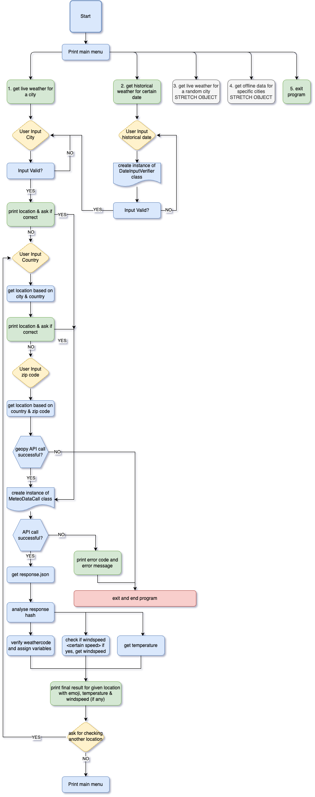

# Sunshine - A CLI Weather App
The main purpose of this CLI terminal based site is, to provide weather information for any given location. It uses a simple CLI based questionary to navigate the user through the app.
It should be a fun way to get real time weather information, using the Free Weather API of [Open-Meteo](https://open-meteo.com/en)


Use the following link to access the [ deployed project on Heroku](https://sunshine-rpf13.herokuapp.com/)

---

## Objectives
This sections covers the main goals, which I had in mind, when creating this project. This project is purely in Python as a simple CLI Terminal app, part of the Code Institute's Project Portfolio 3.

### Main Objectives
My goal was to learn from mistakes I did in the last two projects, specially in the planning phase.
I wanted to include an API and came along the Free Weather API of [Open-Meteo](https://open-meteo.com/en), which I really liked and in combination with using the [Geopy Package](https://pypi.org/project/geopy/), I had an interesting and challenging Python project. I wanted to cover the following main objectives:

- create user input main menu to choose for a feature as well as easy CLI navigation inside each menu
- main feature to get live weather for a location anywhere in the world
- using the geopy Open StreetMap Nominatim API, to find the user input location and get the latitude and longitude information
- create a dedicated class to include the API call to the Open-Meteo API
- display the weather info received from the API and enrich it with further infos based on the weather code, which is part of the API result.
- Temperature and analysis of the weather code, based on [WMO Weather interpretation codes](https://open-meteo.com/en/docs)
- if there is wind, it should be displayed
- option to get historical weather data using the [Historical Open Meteo API](https://open-meteo.com/en/docs/historical-weather-api)
- show historical data for requested location getting the weather code for the daily weather summary, wind information
- correlate the WMO weather interpretation with emojis to display for the user

### Stretch Objectives

The following stretch objectivse are meant as a "nice to have" feature and depending on the time, I will implement them or not.

- get offline data for a specific set of cities (could be all capitals in Europe or similar) for the last year (2022)
- offline data should provide an alternate solution, if either geopy or the weather API is down
- implement a random city feature, intended for users who are curious about weather conditions anywhere in the world, without specifying a place.

## UX & Design
This site is a pure terminal based CLI app, which has limited browser support and runs in a default terminal window size of 80 columns by 24 rows.

### User Stories

- As a visiting user, I would like to immediately understand the navigation through the app
- As a visiting user, I would like to get the live weather data for my given location
- As a visiting user, I would like to get the historical weatehr data for a particular day in past for a particular location.
- As a visiting user, I would like to get the results of the weather displayed in a short and easy to understand format.
- As a visiting user, I would like to get enhanced weather information such as wind, weather condition.

---

## Features

This chapter will describe each feature of the application.

The main goal of this app was to show and improve my Python skills. The deployment via Heroku as well as the deployment template / terminal emulation inside the browser, were provided to be used in this project. With this, there came some limitations. Furthermore, this project is not responsive and runs only on bigger screens. **Please Note, this app will only run in Chrome or Edge browser, without any issues!** This is due to limitations in the way the app is deployed, made accessible as a Terminal app inside the browser as well as some browser issues. More details on that in the testing / bugs section.

### Existing Features

- Main Menu - Entry point
    - The main menu displays a nice welcome message and explains the main purpose of the app
    - It gives a clear and easy overview of the features, from which the user can choose from
    - It tells the user to make it's choice and enter the related number
    - It gives the user the possibility to start / restart the app / terminal, via the big red "Run Program" Button

        

- Live weather data (Menu Item 1)
    - The first feature out of the main menu is live weather data.
    - The user get's prompted to enter a town, for which he wants live weather data.
    
        

    - Once the user has entered the town and pressed enter, he will be presented with a "best match" proposal of the town.
    - The user has the choice to accept the proposal or to deny it, because it was not the town he was looking for.
    - If he accepts the proposal and enters yes, the weather data will be shown, please scroll down a few screenshots for an explanation of this option.
    
        

    - If the user denies the proposal, he will get the option to specify the country, in which his desired town is in.

        

    - Once the user has entered the country and pressed enter, he will be presented with a "best match" proposal of the desired town, based on the country
    - The user has the choice to accept or deny the proposal.
    - If he accepts the proposal and enters yes, the weather data will be shown, please scroll down a few screenshots for an explanation of this option.

        

    - If the user denies the proposal, he will get the option to specify the postal / zip code, in which his desired town is in.

        

    - Once the user has entered the postal / zip code, he will be presented the final result.
    - This is the last step in the decision tree, because while have entered country, town, zip code - it is considered as a unique selection criteria.
    - The user get's displayed the info about the location he has asked for, it is the data, which the geopy Open StreetMap Nominatim database has stored for a particular location. It displays enhanced geoinfo about the location.
    - The live weather is presented, as fetched via the [Open-Meteo](https://open-meteo.com/en) database
    - The first result is the temperature.
    - The second result is the actual weathercondition, which is the translated, standardized [WMO Weather interpretation codes](https://open-meteo.com/en/docs).
    - The weathercondition gets enriched via a matching emoji, to make the interpretation more appealing.
    - The user gets asked, if he wants to make another turn of live wheather, which would clear the screen and bring him back to enter a new town.

        

    - If in any of the above displayed proposals (town, country) the user enters "Y" to accept the proposal, he will  immediately get displayed the weather results, as shown in the next snapshot. The same logic / explanation is valid as previously explained.

        

    - If the user decides to not check another location for live weather and answer the question with "N", he will be sent back to the main menu.
    
- Historical Weather Data (Menu Item 2)
    - The second feature of the main menu is the historical weather data.
    - The user is prompted to enter a historical data, for which he wants to see the weather. For historical data, he weather database is limited, therefore the user is limited to get the weather for the last 50 years.
    - The input format is specified

        

    - The subsequent questions / features are the same as for the live weather, with the only exception, that the wording of the answers is in "the past".
    - The decision tree itself is the same

        


- Weather for Random Location (Menu Item 3)
    - This feature is not implemented yet, however, since planned, I left it on the main menu
    - If a user enters the option 3 for the weather of a random location, he will get a text displayed, saying that the feature is not implemented yet.
    - The user will be informed, that he well be automatically redirected to the main menu

        

- Exit Program (Menu Item 4)
    - This feature will gracefully end the program.
    - The user gets a goodbye message displayed

        

- Start / Restart Program
    - If the user has gracefully exit'ed the program or his browser did run into a timeout, he can start the program via the "RUN PROGRAM" button above the terminal.

        

     
### Future Features

- The Weather for Random Location (Menu Item 4) will be implemented
    - To implement this, the [Geonamescache Package](https://pypi.org/project/geonamescache/) will be used
    - The geonamescache provides various functions, the `get_cities()` function will be used and further processed, to get a random city name.
- Offline City geo-database for all capitals in the world.
    - This feature would be implemented in the way that, for whatever reason the Geopy Open StreetMap Nominatim database would not be available or a user has stressed their API and "violated" the [Usage Policy](https://operations.osmfoundation.org/policies/nominatim/)
    - This feature would store the geoinfo for all the capitals in a database, or a google spreadsheet and will then be used for the API call of the weather database.
- Refactoring the code
    - The current code has much potential to be refactored to implement the DRY (Don't Repeat Yourself) paradigm. As part of future features, refactoring should be among them.

---

## Tools & Technologies Used
I used the following technologies and resources to create this site:

- [Git](https://git-scm.com)
    - Git has been used as the CLI version control tool
- [Github](https://github.com)
    - Github has been used to store the code and publish the site via Github Pages
- [Gitpod](https://gitpod.io/)
    - Gitpod has been used as the local IDE environment
- [Techsini](http://techsini.com/multi-mockup/index.php)
    - Techsini has been used to show an image of the site on various devices
- [OpenStreetMap Geopy Nominatim](https://nominatim.openstreetmap.org/ui/about.html)
    - The OSM Geopy Nominatim API has been used to get the geolocation, via the geopy python package
- [Open Meteo API](https://open-meteo.com/)
    - The Open Meteo API has been used to get all the weather information
- [Markdown Builder](https://traveltimn.github.io/readme-builder)
    - The Markdown Builder by Tim Nelson has been used to help generate the README files
- [Python](https://www.python.org) 
    - Python has been used as the main programming language.
- [CI Python Linter](https://pep8ci.herokuapp.com)
    - The Code Institute Python Linter has been used to verify the code, in addition to the alredy embedded code validator on Gitpod via the CI Python Project Template.
- [Draw.io](https://app.diagrams.net)
    - Draw.io has been used to create the flowchart and export it as png

---

## Data Model

### Logical Flowchart
The following flowchart displays the logic behind the app, it should be seen as kind of "wireframe", which I have used to have a rough estimate and structure, while building the code for the application.



### Classes, their Methods & Functions

This chapter will give a brief explanation on the classes, their related methods and the functions, used in the code.
I have created two classes for code, which I re-usable and to me, is a perfect place to live in a class.
Furthermore, there are a couple of helpe functions, which are also built in a generic way to be re-used, whenever they are applicable.

#### The MeteoDataCall Class
This class contains two methods; the `live_data()` and the `historical_data()` method. The class itself takes one argument, when called - the coordinates, which is actually an array with two elements, the latitude [0] and the longitude [1]. Since both methods needs the coordinates as input, it has been specified at the class level.

The `live_data()` method, does not require additional paramters, when called. The main purpose of this method is, to execute the api call to the open-meteo api. The url string for the api call is statically set as variable, but taking the coordinates array elemtens via string interpolation.
It uses the requests library to make a GET request to the open-meteo.com API with the given location. The raise_for_status method is called on the response object to raise an exception if the API returns a non-successful
status code.

The request call is wrapped in a try block, and any HTTPError exceptions that are raised during the requestare caught in the except block.
The return value of the api is a json, which will be further processed as the return value.
If an exception gets raised, the program gets **intentionally** terminated, because it does not make sense toc ontinue the program, if the API has a problem.
If there is an HTTP error, not getting code 200 back from the API, the status code is displayed to the user. For all the other, unknown errors, no error details are displayed.

The `historical_data()` method works the same way as the previously explained `live_data()` method, with the only difference, that it needs an additional argument, when called. It requires the date, for which the user wants toget the historical weather info. 
The url for the API call uses again the coordinates array values and, as explained, the historical date. The rest of the method is the same.


<details>
<summary>MeteoDataCall Class Code</summary>

```python
class MeteoDataCall:
    """
    Class to execute api call for live and historical
    weather on open-meteo.com. Error handling done at
    this stage.
    """
    def __init__(self, coordinates):
        # instance attributes
        self.coordinates = coordinates

    def live_data(self):
        """
        Method to call API for live data and return json
        If call is unsuccessful, start exception handling.
        """
        url = f"https://api.open-meteo.com/v1/forecast?latitude={self.coordinates[0]}&longitude={self.coordinates[1]}&current_weather=true&windspeed_unit=kmh"  # noqa
        # Create the actual api call. If the request is successful,
        # the raise_for_status() method is called to check for any HTTP errors,
        # such as a 4xx or 5xx status code.
        # If no errors are found, the JSON response is returned.
        try:
            response = requests.get(url)
            response.raise_for_status()
            return response.json()
        # Handle known HTTP error and exit
        except requests.exceptions.HTTPError as error:
            sys.exit(
                "An error has occured when calling the Open-Weather API \n"
                "Unfortunately we cannot get the weather data now. \n"
                "Please try again later! \n"
                "The API has returned the status code: {}".format(error)
                )
        # Handle any unknown API error and exit
        except Exception as error:
            sys.exit(
                f"There was an undefined error with the Open-Weather API \n"
                "Please try again later"
                )

    def historical_data(self, hist_date):
        """
        Method to call API for historical data and return json
        If call is unsuccessful, start exception handling.
        """
        self.hist_date = hist_date
        url = f"https://archive-api.open-meteo.com/v1/era5?latitude={self.coordinates[0]}&longitude={self.coordinates[1]}&start_date={self.hist_date}&end_date={self.hist_date}&daily=weathercode,temperature_2m_max,windspeed_10m_max&timezone=auto"  # noqa
        # Create the actual api call. If the request is successful,
        # the raise_for_status() method is called to check for any HTTP errors,
        # such as a 4xx or 5xx status code.
        # If no errors are found, the JSON response is returned.
        try:
            response = requests.get(url)
            response.raise_for_status()
            return response.json()
        # Handle known HTTP error and exit
        except requests.exceptions.HTTPError as error:
            sys.exit(
                "An error has occured when calling the Open-Weather API \n"
                "Unfortunately we cannot get the weather data now. \n"
                "Please try again later! \n"
                "The API has returned the status code: {}".format(error)
                )
        # Handle any unknown API error and exit
        except Exception as error:
            sys.exit(
                f"There was an undefined error with the Open-Weather API \n"
                "Please try again later"
                )
```

</details>


#### The DateInputVerifier Class
This class is used for the historical weather feature and is used to verfiy if the date input is valid and according to the requirements. The class itself does not require any arguments and it has the basic date syntax stored in the pattern variable. This simple regex checks only the amount of digits and the required hyphen.

The `is_valid()` method takes the date as an input parameter. A conditional sequence starts, first of all is the check of the input against the pattern - the regex. If that is passed, it will split the input at the hyphen and allocate the variables year, month, day to it.

The month get's checked if it is valid, only integers between 1 and 12 are valid.
The day gets checked if it is valid, only integers between 1 and 31 are valid.
The year gets checked, if it is max. 50 years back from the current year. This requirement comes from the weather api, which has limited historical data.
If any of the check results is invalid, False will be returned, otherwise True. This info will the be further processed in the calling function.


<details>
<summary>DateInputVerifier Class Code</summary>

```python
class DateInputVerifier:
    """
    Date verification class, used to verify user input. It checks
    if input is valid in terms of month, day numbers and it
    checks if year is max. 50 years back, since open-weather API
    does not support endless historical data
    """
    def __init__(self):
        # Instance attribute
        self.pattern = r"^\d{4}-\d{2}-\d{2}$"

    def is_valid(self, date):
        """
        Verify that the input string matches the
        desired time format (YYYY-MM-DD) and is valid
        Returns boolean value used further in the calling part
        """
        # Check if the date matches the pattern
        if not re.match(self.pattern, date):
            return False

        # Split the date into year, month, and day
        year, month, day = date.split("-")
        year, month, day = int(year), int(month), int(day)

        # Check if the month is within the range of 1-12
        if month < 1 or month > 12:
            return False

        # Check if the day is within the range of 1-31
        if day < 1 or day > 31:
            return False

        # Check if the year is within the range of 50 years back in time
        current_year = datetime.datetime.now().year
        if year > current_year or year < current_year - 50:
            return False

        # If all checks pass, return True
        return True
```

</details>


#### Functions

The following is a list of functions, used in this project. A brief explanation is given regarding their functionality. A more detailed description of each function can be found in the code itself in form of comments.

- `clear_screen()`
    - As the name sais, it will clear the screen. It uses the os.system module.
- `ask_input(question, options)`
    - This generic helper function is used to create the "ask input loop", if a user has to enter Y or N or any other input question, like the one of the main menu. The function is generic and could be used for any other input questions, since the question and the answers (named as options), are input parameters.
- `validate_input(string)`
    - Validates the input for town and country names and checks for valid syntax
- `validate_address()`
    - Ask's for the town and calls the `validate_input` to validate input
- `validate_country()`
    - Same logic as the `validate_address()`, but ask's for a country
- `validate_zip_input(string)`
    - Postal code / zip validation for proper syntax
- `validate_postalcode()`
    - Ask's for the postal / zip code and calls the `validate_zip_input()` to validate it
- `get_location()`
    - This is one of the two "API functions". It is responsible to get the coordinates via geopy OSM Nominatim API (via the geopy package). It returns an array with latitude, longitude. It calls the previously mentioned validation functions to verify user input. There are several try / except blocks, to do proper error handling at each individual step. The call is smart and kind of lagnauge aware, it will automatically return the best match. However, it has it's limitations, if the input is too weird and does not match at all, it will return "None", which will be handled as an exception. 
- `translate_weathercode(weathercode)`
    This function takes the weathercode, which we get via the `MeteoDataCall` class, as argument and translates it to a human readable text string. It returns the string via the weathercondition variable.
- `get_live_weather()`
    - This function is the "main driver" for the live weather feature. It calls all necessary classes, methods and functions and correlates them together. It **intentionally** uses a "hard" sys.exit, if no geoinfo could be fetched via the geopy API. It does not make sense to continue the program, if there is no geoinfo. It does further error checking for each other level. It "stitches" the weathercode with the emoji's together (called via dedicated CONDITIONS constant, which is basically a hash). It uses the text string of the weathercode and replaces any whitespaces with underline to find then the related key in the hash.
- `live_weather_loop()`
    - This function is the loop to repeatedly ask the user if he wants to get the live weather for another location. It calls the `ask_input()` function to validate the input.
- `get_historical_weather()`
    - This function is the "main driver" for the historical weather feature. It calls all necessary classes, methods and functions and correlates them together. Unlike the `get_live_weather()` function, it starts with asking the user for a date as input, which get's verified via the `DateInputVerifier()` class and it's related method. The rest of the function follows the same concept as the `get_live_weather()` function, it does also **intentionally** use a "hard" sys.exit.
- `historical_weather_loop()`
    - counterpart to the `live_weather_loop()`, but for the historical weather.
- `main()`
    - This is the main driver for the whole program, a while loop to display the menu and verfies the user input. It uses the pyfiglet paket to display the welcoming header. It does also use the `ask_input()` helper function, to check if the user input is valid or not.

#### Other Python Files

The program contains the my_emoji.py file, which contains a constant called `CONDITIONS`, which is a hash with it's keys matching the weathercondition strings and allocate each of them a related emoji. The emoji's are standard unicode elements.

### Imports

Besides the inport of my own classes and the my_emoji file, I've used the following Python packages and/or external imported packages.

- `geopy` geocoding package used for OSM [geopy](https://pypi.org/project/geopy/)
- `Nominatim` as part of the geopy packate, the [Open Street Map](https://nominatim.org) geocoding API Service
- `os`used for adding `clear()` function [os](https://pypi.org/project/os0/)
- `pyfiglet` used for the ascii text to render it into ascii art font [pyfiglet](https://github.com/pwaller/pyfiglet)
- `time` used for sleep feature in the `main()` function
- `sys` is used for the proper way to exit the program
- `re` has been used for all the regular expressions
- `requests` has been used to execute the api calls [requests](https://pypi.org/project/requests/)
- `datetime` is used for the date verification class, to get the current year [datetime](https://pypi.org/project/datetime2/)
- `MeteoDataCall`, `DateInputVerifier`, `my_emoji` are my own classes, files, which have been imported.

---

## Testing

For all testing, please refer to the [TESTING.md](TESTING.md) file.

---

## Development
The following chapters will give some insights on my thinking process and why I have decided to use things the way they are.

### Limitations
During deployment / testing of the app (see [TESTING.md](TESTING.md)), I have figured out, that browser support for this way of running the terminal app in the browser is not the best. It runs only flawlessly in the Chrome / Edge browser. Safari does not work at all and in Firefox, the emoji's are cut in half, see open bug / limitation for it [#2](https://github.com/rpf13/sunshine/issues/2)

### Challenges 
This project was a big, but very welcomed challange to me. I LOVED IT and I have figured out, that I really like Python!
I did not want to build another "Hangman, Battleship, ..." game, which many students go for at this point for their Project Portfolio 3 work. A working colleague told me: "Why don't you create a cli based weather app", an I fell in love with the idea.
Since we did not yet cover API's (except the basic Google Spreadsheet API), I really had to get to know on how this is done. The open-weather API is a relatively easy one, since it does not require authentication.

I did also set myself the goal to use self created classes, use additional modules. Classes are a great concept in coding to limit repetition, following the DRY paradigm and therefore create "generic build plans", to instantiate when needed.

I also wanted to showcase my basic regex knowledge and this was the reason I have used it at some parts. Well, how else to verify input? Regex is the easiest way.

One of the biggest challenges was to understand the geopy package - the Nominatim OpenStreetMap api. I did face quite some challanges, since I did not entirely read the documentation and the limitations / usage policy upfront [Usage Policy](https://operations.osmfoundation.org/policies/nominatim/). This brought me to implement some better error handling.

### Error Handling
I did take great attention and big efforts on the error handling. Since I am using two API's, this was quite a challenge. I have tried to do extensive error handling in order, to prevent the application to fail and just diplay errors to the user. I did also **intentionally** use the sys.exit on a few places, which would exit the user from the program if a certain condition is met (in combination with displaying a reason). If the geopy API does not return a result, or the API call to the open-weather API fails, there is not reason to continue the program. I am strongly convinced, it is the right decision to exit the program in such a case.

I have tried to cover every possible error or using a generic error handling via the try / except blocks to prevent a bad experiense. In combination with the many while loops and user inputs, it was a big challenge. This was also the main reason, why I did create the dedicated `ask_input()` function, which outsources the check of the correct input - given a choice like Y / N. The way I wrote code did not work when having this check inside the related function.
Anyway, it is great to have such a repetitive task in a generic, dedicated function.

As mentioned, I did my best to catch all possible errors, however, it is difficult to simulate all possible errors when using an API. Therefore I have tried to catch them with the generic error handling in the try / except blocks.

With all the error handling in place, if a user wants to intetionally break the app, it is still possible. But, this was not the aim to prevent that. The error handling should be in place to cover accidently wrong input or if an API is not available.

### Refactoring

When I look at the code, I know there is a big potential to do refactoring and create more generic functions, which then get called with the related parameters. I am aware of the fact that I did not entierly follow the DRY (Don't Repeat Yourself) principle. However, at a certain point in time I had to find an end for the project, given the time constraints. 

### Commit messages

I have decided to mostly use multiline commit messages. Commit messages are an essential part of the whole project and a single line commit message is just not enough to explain. After reading [this interesting article](https://cbea.ms/git-commit/), it was clear to me, that I have to use it.

I have decided to use (mostly) multiline commits, but using tags as described this [cheatsheet](https://cheatography.com/albelop/cheat-sheets/conventional-commits/) or as also described in the LMS of the Code Institute. I did use the following syntax guidline:
- **feat:** for feature which may or may not include a CSS part
- **fix:** for a bugfix
- **style:** for changes to CSS or to give style to the code itself
- **docs:** for changes related to documentation
- **refactor:** for refactored code, re-written code
- **maint:** for general maintenance

---

# Deployment

Code Institute has provided a [template](https://github.com/Code-Institute-Org/python-essentials-template) to display the terminal view of this backend application in a modern web browser.
This is to improve the accessibility of the project to others.

The live deployed application can be found deployed on [Heroku](https://sunshine-rpf13.herokuapp.com).

### Heroku Deployment

This project uses [Heroku](https://www.heroku.com), a platform as a service (PaaS) that enables developers to build, run, and operate applications entirely in the cloud.

Deployment steps are as follows, after account setup:

- Select **New** in the top-right corner of your Heroku Dashboard, and select **Create new app** from the dropdown menu.
- Your app name must be unique, and then choose a region closest to you (EU or USA), and finally, select **Create App**.
- From the new app **Settings**, click **Reveal Config Vars**, and set the value of KEY to `PORT`, and the value to `8000` then select *add*.
- Further down, to support dependencies, select **Add Buildpack**.
- The order of the buildpacks is important, select `Python` first, then `Node.js` second. (if they are not in this order, you can drag them to rearrange them)

Heroku needs two additional files in order to deploy properly.
- requirements.txt
- Procfile

You can install this project's **requirements** (where applicable) using:
- `pip3 install -r requirements.txt`

The requirements file needs updated using:
- `pip3 freeze --local > requirements.txt`
- Even though `requests` package is part of Python, it is required for this project to mention it in this file, otherwise the API calls will fail. The above mentioned command will not add it to the file. Add the following line in the requirements.txt file: `requests==2.28.1`

For Heroku deployment, follow these steps to connect your own GitHub repository to the newly created app:

Either:
- Select **Automatic Deployment** from the Heroku app.

Or:
- In the Terminal/CLI, connect to Heroku using this command: `heroku login -i`
- Set the remote for Heroku: `heroku git:remote -a app_name` (replace *app_name* with your app name)
- After performing the standard Git `add`, `commit`, and `push` to GitHub, you can now type:
	- `git push heroku main`

The frontend terminal should now be connected and deployed to Heroku!

### Local Deployment

This project can be cloned or forked in order to make a local copy on your own system.

For either method, you will need to install any applicable packages found within the *requirements.txt* file.
- `pip3 install -r requirements.txt`.

#### Cloning

You can clone the repository by following these steps:

1. Go to the [GitHub repository](https://github.com/rpf13/sunshine) 
2. Locate the Code button above the list of files and click it 
3. Select if you prefer to clone using HTTPS, SSH, or GitHub CLI and click the copy button to copy the URL to your clipboard
4. Open Git Bash or Terminal
5. Change the current working directory to the one where you want the cloned directory
6. In your IDE Terminal, type the following command to clone my repository:
	- `git clone https://github.com/rpf13/sunshine.git`
7. Press Enter to create your local clone.

Alternatively, if using Gitpod, you can click below to create your own workspace using this repository.

[](https://gitpod.io/#https://github.com/rpf13/sunshine)

Please note that in order to directly open the project in Gitpod, you need to have the browser extension installed.
A tutorial on how to do that can be found [here](https://www.gitpod.io/docs/configure/user-settings/browser-extension).

#### Forking

By forking the GitHub Repository, we make a copy of the original repository on our GitHub account to view and/or make changes without affecting the original owner's repository.
You can fork this repository by using the following steps:

1. Log in to GitHub and locate the [GitHub Repository](https://github.com/rpf13/sunshine)
2. At the top of the Repository (not top of page) just above the "Settings" Button on the menu, locate the "Fork" Button.
3. Once clicked, you should now have a copy of the original repository in your own GitHub account!


## Credits

### Code & Methodology

I had to do quite some research for this project, especially calling the two API's and the proper error handling has been a challenge. I have used many resources in order to understnad the related concept and then further use it in my project.

The following list of sources has been used:

| Source | Notes |
| --- | --- |
| [Markdown Builder by Tim Nelson](https://traveltimn.github.io/readme-builder) | tool to help generate the Markdown files for README and TESTING |
| [Chris Beams](https://chris.beams.io/posts/git-commit) | "How to Write a Git Commit Message" |
| [GeekforGeeks](https://www.geeksforgeeks.org) | This was my main goto site to look up any python related questin I had |
| [YouTube](https://youtu.be/LC1-VD2eeR0) | This tutorial "Fetch lyrics from an API and parse the JSON response" has helped me to understand how to create a GET request and parse the returning JSON |
| [PyPi geopy Documentation](https://pypi.org/project/geopy/) | The official documention of geopy has helped me to understand the package and it's capabilities |
| [Stackexchange](https://gis.stackexchange.com/questions/293615/user-agent-argument-in-nominatim-in-geopy) | This answer has helped to understand why I need a User_Agent argument in the geopy call |
| [AskPython](https://www.askpython.com/python/python-geopy-to-find-geocode-of-an-address) | This article was a big help to understand how to use geopy and get the desired results |
| [Nominatim.org](https://nominatim.org/release-docs/develop/api/Search/) | The official Nominatim documentation has teached me how to use search arguments in order to search for location, country, postalcode |
| [OSM Foundation](https://operations.osmfoundation.org/policies/nominatim/) | This article was a big help to find out the limitations of the free Nominatim API service. It helped me to troubleshoot, when I got errors from the API, while I was repeatedly querying for the same location. |
| [Pypi geonamescache Documentation](https://pypi.org/project/geonamescache/) | This article has helped me to understnad, how to get a random location name, which will be part in the stretch - further features, implementation of getting the weather from a random location. |
| [CodeSpeedy](https://www.codespeedy.com/select-a-random-element-from-a-tuple-in-python/) | This article has helped me to understand how to select a random element from a tuple, which I would need to implement in the stretch - further features, implementation of getting the weather from a random location. |
| [GeekforGeeks](https://www.geeksforgeeks.org/python-ascii-art-using-pyfiglet-module/) | This tutorial has been used to implement the pyfiglet ASCII art for the intro title |
| [Figlet](http://www.figlet.org/examples.html) | Figlet has helped me to choose one of the available fonts |
| [RealPython](https://realpython.com/python-sleep/) | Article helping me to understand sleep() function |
| [GeekforGeeks](https://www.geeksforgeeks.org/python-exit-commands-quit-exit-sys-exit-and-os-_exit/) | Great article on teaching me the right way of using an exit in a program and compare the various options.

### Acknowledgements
- A very big Thank You goes to my mentor Tim Nelson, who critically checked my application and helped in so many ways. Tim, you are an awesome inspiration, I cannot thank you enough!
- A huge thank you goes to my working colleagu Hans Heisig, who brought me up to the initial idea: "Hey, why don't you create a CLI weather app?". I thank you a lot for bringing up this idea, which I have liked from the beginning. However, it was a very challenging journey. I am very thankful for the time you did invest to "intentionally break" my application and gave me great advice regarding error handling. You are an awesome, helpful person - Thank You!
- Without the support of my wife and my little son, it would not have been possible to spend endless hours, working on this project and doing research. Many thanks to my little son for giving me a smile and very welcomed distraction, during times I was frustrated.
- Thanks to all the friends and co workers, who have tested out the application - and have tried to find the sunshine...

