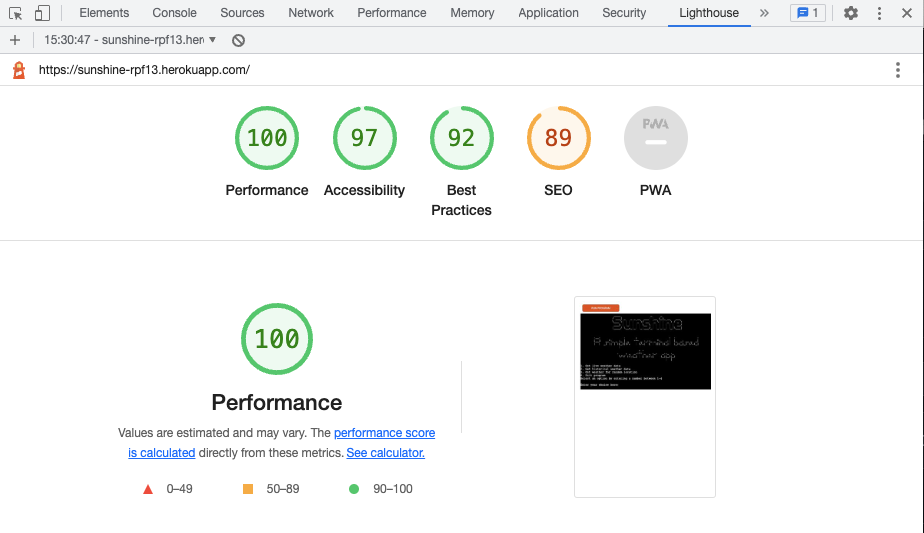

# Testing

Return back to the [README.md](README.md) file.

I have invested quite some efforts to do proper testing of the (deployed) application. I did try to catch all sorts of errors of the API's as well errors for wrong user input. This is also explained in the Development section of the README file.
I did try to simulate some of the API errors, as it can be seen in the coming chapters. However, I could not simulate each and every possible error, therefore I did add a lot of generic error handling in the try / except blocks.

## Python Code Validation

I have used the recommended [CI Python Linter](https://pep8ci.herokuapp.com) to validate all of my Python files.

The CI Python Linter can be used two different ways.
- Copy/Paste your Python code directly into the linter.
- As an API, using the "raw" URL appended to the linter URL.
    - To find the "raw" URL, navigate to your file directly on the GitHub repo.
    - On that page, GitHub provides a button on the right called "Raw" that you can click on.
    - From that new page, copy the full URL, and paste it after the CI Python Linter URL (with a `/` separator).
    - Examples:

    | File | CI URL | Raw URL | Combined |
    | --- | --- | --- | --- |
    | PP3 *run.py* file | `https://pep8ci.herokuapp.com/` | `https://raw.githubusercontent.com/rpf13/sunshine/main/run.py` | `https://pep8ci.herokuapp.com/https://raw.githubusercontent.com/rpf13/sunshine/main/run.py` |

I have used the "raw" url-method to validate my python files. I did spend quite some efforts to be inline with the requirement of not exceeding 80 characters in width, for any code line. However, in case of the API url's, I could not find a way to insert a new line, therefore I have used the `noqa` = **NO Quality Assurance** tag in the code.

Code Validation Summary Table

Below a table with the summary of the Python checker. The CI Linter URL is included, as well as a link to the related screenshot.

| File | CI URL | Screenshot | Notes |
| --- | --- | --- | --- |
| run.py | [CI PEP8](https://pep8ci.herokuapp.com/https://raw.githubusercontent.com/rpf13/sunshine/main/run.py) | [screenshot](docs/testing/pep8_main.png) | All clear, no errors found |
| classes.py | [CI PEP8](https://pep8ci.herokuapp.com/https://raw.githubusercontent.com/rpf13/sunshine/main/classes.py) | [screenshot](docs/testing/pep8_classes.png) | All clear, no errors found |
| my_emoji.py | [CI PEP8](https://pep8ci.herokuapp.com/https://raw.githubusercontent.com/rpf13/sunshine/main/my_emoji.py) | [screenshot](docs/testing/pep8_my_emoji.png) | All clear, no errors found |

## Lighthouse Testing

Even though this is a terminal based cli app, I wanted to run the lighthouse test, to see the performance. Since the deployment template and all it's settings was given by Code Institute as a requirement, I did not change anything on it. I think the testing results are fine.

    TODO: Add comment on limitations / browser support

    TODO: Add separate chapter on how I have used breakpoint() to tshoot inline