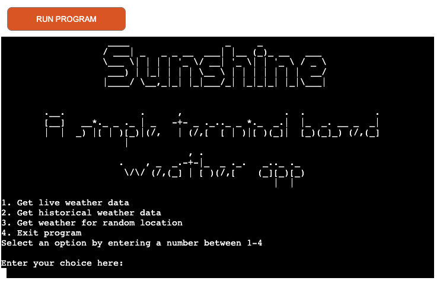
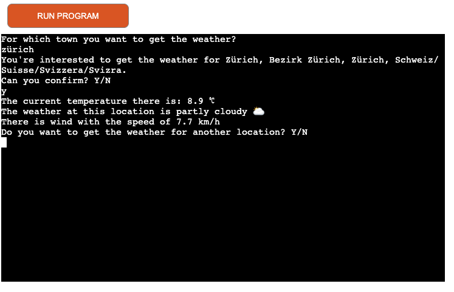
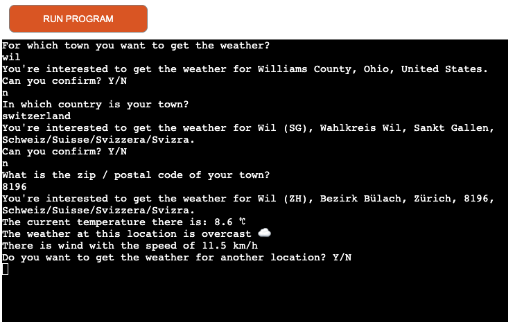
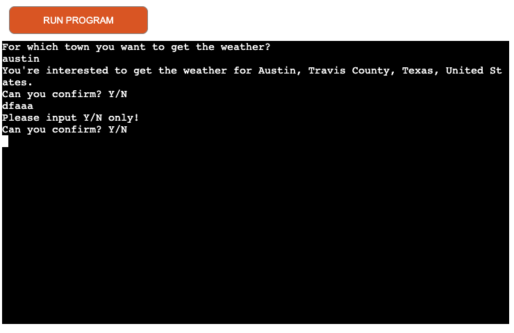
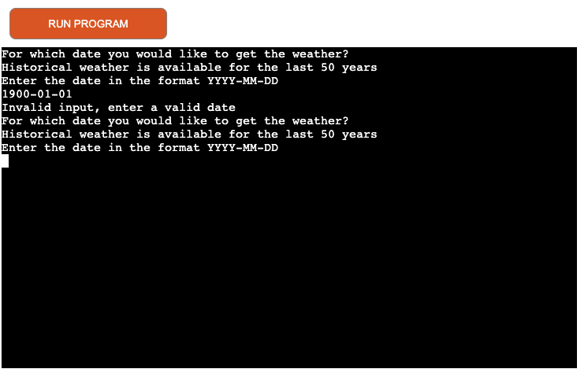
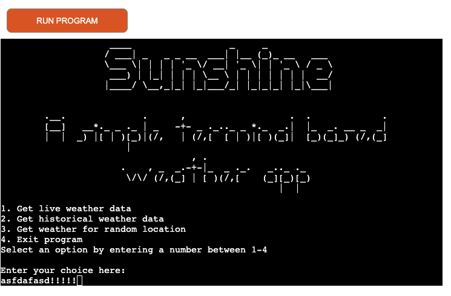

# Testing

Return back to the [README.md](README.md) file.

I have invested quite some efforts to do proper testing of the (deployed) application. I did try to catch all sorts of errors of the API's as well errors for wrong user input. This is also explained in the Development section of the README file.
I did try to simulate some of the API errors, as it can be seen in the coming chapters. However, I could not simulate each and every possible error, therefore I did add a lot of generic error handling in the try / except blocks.

---

## Python Code Validation

I have used the recommended [CI Python Linter](https://pep8ci.herokuapp.com) to validate all of my Python files.

The CI Python Linter can be used two different ways.
- Copy/Paste your Python code directly into the linter.
- As an API, using the "raw" URL appended to the linter URL.
    - To find the "raw" URL, navigate to your file directly on the GitHub repo.
    - On that page, GitHub provides a button on the right called "Raw" that you can click on.
    - From that new page, copy the full URL, and paste it after the CI Python Linter URL (with a `/` separator).
    - Examples:

    | File | CI URL | Raw URL | Combined |
    | --- | --- | --- | --- |
    | PP3 *run.py* file | `https://pep8ci.herokuapp.com/` | `https://raw.githubusercontent.com/rpf13/sunshine/main/run.py` | `https://pep8ci.herokuapp.com/https://raw.githubusercontent.com/rpf13/sunshine/main/run.py` |

I have used the "raw" url-method to validate my python files. I did spend quite some efforts to be inline with the requirement of not exceeding 80 characters in width, for any code line. However, in case of the API url's, I could not find a way to insert a new line, therefore I have used the `noqa` = **NO Quality Assurance** tag in the code.

Code Validation Summary Table

Below a table with the summary of the Python checker. The CI Linter URL is included, as well as a link to the related screenshot.

| File | CI URL | Screenshot | Notes |
| --- | --- | --- | --- |
| run.py | [CI PEP8](https://pep8ci.herokuapp.com/https://raw.githubusercontent.com/rpf13/sunshine/main/run.py) |  | All clear, no errors found |
| classes.py | [CI PEP8](https://pep8ci.herokuapp.com/https://raw.githubusercontent.com/rpf13/sunshine/main/classes.py) |  | All clear, no errors found |
| my_emoji.py | [CI PEP8](https://pep8ci.herokuapp.com/https://raw.githubusercontent.com/rpf13/sunshine/main/my_emoji.py) |  | All clear, no errors found |

---

## Lighthouse Testing

Even though this is a terminal based cli app, I wanted to run the lighthouse test, to see the performance. Since the deployment template and all it's settings was given by Code Institute as a requirement, I did not change anything on it. I think the testing results are fine.


---

## User Stories Testing

This chapter will focus on the user story testing, giving a snapshot for each feature.

| User Story | Screenshot | Notes |
| --- | --- | --- |
| - As a visiting user, I would like to immediately understand the navigation through the app |   | This has been achieved via the simple menu and the exact questions / possible answers for each section |
| - As a visiting user, I would like to get the live weather data for my given location |  | Any possible location can be set as the input |
| - As a visiting user, I would like to get the historical weatehr data for a particular day in past for a particular location. |  | The historical weather let's the user check any location for the last 50 years |
| - As a visiting user, I would like to get the results of the weather displayed in a short and easy to understand format. |  | The weather data get's displayed in a simple way; the temperature is a clear number and the weather interpretation is achieved via a short but distinctive sentence - supported via the emoji's. The wind is also displayed an easy to understand format. |
| - As a visiting user, I would like to get enhanced weather information such as wind, weather condition. |  | Wind and weather condition are part of every reply |

---

## Browser Compatibility
The main validation of the app has been done via Chrome on Mac OS X. However, I did test it on furhter browsers and OS's.
The following table will give an overview of all combinations, where the site has been tested. Browser compatibility is very limited, but this is due to the nature of this terminal emulated app inside a browser.

|                           | Chrome |        Firefox        | Safari | Edge |                                                                     Notes                                                                     |
|:-------------------------:|:------:|:---------------------:|:------:|:----:|:---------------------------------------------------------------------------------------------------------------------------------------------:|
| OS X 13.1 MacBook Pro 16" |  PASS  | PASS (w. Limitations) |  FAIL  | N.A. | See Bugs Section for info regarding Firefox. Safari does not seem to be supported with this deployment template, it wont even correctly start |
|  iPadOS 16.2 iPad Pro 11" |  N.A.  |          N.A.         |  N.A.  | N.A. | iPad / Tablets do not seem to work, the page loads but input is not possible.                                                                 |
|    Windows 10 Pro 21H1    |  PASS  | PASS (w. Limitations) |  N.A.  | PASS |                                                                                                                                               |
|       Mobile Phones       |  N.A.  |          N.A.         |  N.A.  | N.A. | Mobile Phones not supported due to the fixed setting of the terminal in the App                                                               |

---

## Error Handling Testing
I have spent quite some efforts trying to catch every error. The errors have to be separated into two groups:

1. User Input Errors - by mistake, mistyping: They are handled in the way that input validation is executed. If the input is invalid, the user will be repeteadly prompted to enter the valid format.

2. API program errors: These are the more difficult errors, which I have tried to catch with several try / except statements. I did also try to simulate some of the errors, in order to test them.

**PLEASE NOTE:** The input validation is done based on the above mentioned criterias. If a user wants to intentionally break the program, it is very likely, that he will be able to do so. But this is not the aim of the program / the error handling. The error handling is done to deal with errors my mistake or by API errors.

### User Input Errors

Since these type of errors are handled "externally" via dedicated function or even via a dedicated class and only referenced in the code, the behaviour is always the same. Here some examples:

- In all the confirmation questions, if the user enters a invalid input, not entering y / n, the error is caught and he will be repeteadely asked.

    

- Input validation for address, country, postal code

    - The address input is validated for correct and valid input. The same applies for the country and postal code / zip input. 
    - For postalcode / zip and country input, the [postal code format](https://kb.bullseyelocations.com/article/93-postal-code-formats) and [list countries](https://www.worldometers.info/geography/alphabetical-list-of-countries/) have been considered.
    - Wrong inputs will relate to a message prompted and the user gets asked again.

        
        

- Invalid Date Format

    - If the user enters an invalid date format or a date, which is more than 50 years in past, he will get an error and will be repeatedly asked to enter a valid date.

        

- Input error on main menu
    - If the user creates a wrong input in the main menu, the "loop" will just restart and ask's the same question again, until a valid input has been done.

        


### API & Program Errors

The following "test-errors" have been executed in gitpod, because I did not want to deploy the wrong error code and it was much simpler to test in gitpod.


- The following test is a simulation, if for any reason, the geopy API returns wrong, invalid coordinates. The test has been done in the live weather option, via replacing the geopy function call with a static array with dummy geolocation data. The error get's correctly caught and in this particular case, es previously explained, the API error gets displayed to the user. A sys.exit happens and the user get's told that there is an API problem.
    ```py
    # coordinates = get_location() -> This would be the correct function call
    coordinates = ['ada', 'beda']
    # Error displayed on the CLI
    An error has occured when calling the Open-Weather API 
    Unfortunately we cannot get the weather data now. 
    Please try again later! 
    The API has returned the status code: 400 Client Error: Bad Request for url: https://api.open-meteo.com/v1/forecast?latitude=ada&longitude=beda&current_weather=true&windspeed_unit=kmh
    gitpod /workspace/sunshine (main) $ 
    ```
- The next test shows, what happens if geopy retunrs None, because for whatever reaseon, it could not find amatching location. Again, simulated via setting None manually as the return value for the Array.
    ```py
    # coordinates = get_location() -> This would be the correct function call
    coordinates = None
    if coordinates is None:
        sys.exit(
            "There was an error when calling the Open StreetMap "
            "API to get the desired location data. "
        )
    # Error displayed on the CLI
    There was an error when calling the Open StreetMap API to get the desired location data. 
    gitpod /workspace/sunshine (main) $ 
    ```

- This test shows, what happens if the geopy Nominatim API get's stressed too much. The geopy module api, especially the free version used via the Open Street Maps from geopy.geocoders import Nominatim is not available for excessive use. If one tries over and over again asking for the same location, it will refuse to send a reply, as shown in the snapshot.
This is mentioned on their webpage: https://nominatim.org/. I did not want to do this test again and again, since I do not want to get blocked from using their api, which would break my application. Therefore, I will showcase this error via a snapshot, which I did during development. However, the displayed error on the cli is different from the final version.

    

    In the final version, the error displayed would be different, since this error get's caught on two different places: As a first step, it will be handled inside the get_location() function, for each call, displaying the related text:

    ```py
    # try / except block to handle geopy api errors
    try:
        location = geolocator.geocode(f"{address}, {country}")
    except GeocoderUnavailable:
        print("The Geocoder API is currently unavailable")
        return
    except Exception as error:
        print(f"There was an undefined error {error}")
        return
    ```

    As a second step, the program will be terminated. When calling the get_live_weather() or the get_historical_weather() function, there is a second error handling in place that if I did not get proper coordinates back (we expect an array with two values), it will again handle the exception and exit the program, since there is no reason to ask the weather api with false geodata.

---

## Using Python's breakpoint() feature
While creating this project, I did heavily depend on using / inserting `breakpoint()` in order to test the code at the very moment, seeing values of a variable or whatever was needed to debug. Since I have some basic knowledge with Ruby programming language, I was so used to debug via Ruby’s `binding.pry` method, which lead me to search for the similar option in python.

As an example how I used it, I wanted to verify the content of the weathercode, weatherdata variable, so I have set a breakpoint in the following code

```py
def translate_weathercode():
    """
    Function to translate the weathercode into a human readable code
    and assign ascii art element to it.
    """
    weathercode = weatherdata["current_weather"]["weathercode"]
    breakpoint()
    if weathercode == 0:
```

I could easily check the content and with the “embedded” navigation options in Pbd, I could go ahead.

```py
c -> continue execution
q -> quit the debugger/execution
n -> step to next line within the same function
s -> step to next line in this function or a called function
```

Here an example of how I used it when setting a `breakpoint()` in above's mentioned code:
```py
gitpod /workspace/sunshine (main) $ python3 run.py 
{'latitude': 46.2, 'longitude': 6.14, 'generationtime_ms': 0.28693675994873047, 'utc_offset_seconds': 0, 'timezone': 'GMT', 'timezone_abbreviation': 'GMT', 'elevation': 400.0, 'current_weather': {'temperature': 11.2, 'windspeed': 13.0, 'winddirection': 236.0, 'weathercode': 61, 'time': '2022-12-30T15:00'}}
61
> /workspace/sunshine/run.py(162)translate_weathercode()
-> if weathercode == 0:
(Pdb) print(weathercode)
61
(Pdb) print(weatherdata)
{'latitude': 46.2, 'longitude': 6.14, 'generationtime_ms': 0.28693675994873047, 'utc_offset_seconds': 0, 'timezone': 'GMT', 'timezone_abbreviation': 'GMT', 'elevation': 400.0, 'current_weather': {'temperature': 11.2, 'windspeed': 13.0, 'winddirection': 236.0, 'weathercode': 61, 'time': '2022-12-30T15:00'}}
(Pdb) 
{'latitude': 46.2, 'longitude': 6.14, 'generationtime_ms': 0.28693675994873047, 'utc_offset_seconds': 0, 'timezone': 'GMT', 'timezone_abbreviation': 'GMT', 'elevation': 400.0, 'current_weather': {'temperature': 11.2, 'windspeed': 13.0, 'winddirection': 236.0, 'weathercode': 61, 'time': '2022-12-30T15:00'}}
(Pdb) 
```

---

## Bugs - Github Issues
I have used Github Issues to track bugs. I did only open a bug, if I could not immediately find a solutior or I did consider it a bigger issue. I did not consider "issues during development" as a bug. This is the reason, why I do not have to show a lot in this section.
However, all documentation on details of an issue as well as the path to resolve it, is documented in the issues section of the repo via my [Github](https://github.com/rpf13/sunshine/issues) account.

**Issues Table**

The whole Github Issues section for my project can be accessed [here](https://github.com/rpf13/sunshine/issues). The following table will give an overview:

| Bug | Github Link | Status |
| --- | --- | --- |
| Firefox shows emoji's cut by half | [Issue #2](https://github.com/rpf13/sunshine/issues/2) | Open |
| Geopy error if API stressed out | [Issue #1](https://github.com/rpf13/sunshine/issues/1) | Closed |

There are no other remaining bugs, I am aware of.


